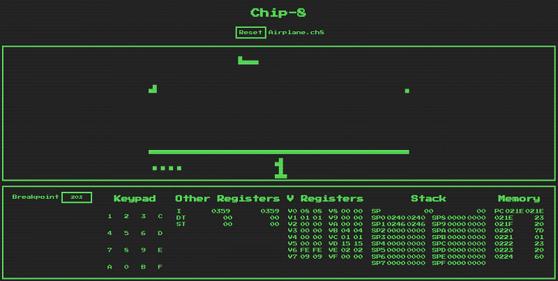

[](https://travis-ci.org/leandrogaspar/chip8) [](https://greenkeeper.io/)

# Chip-8
> A Chip-8 interpreter for the browser!

[](https://leandrogaspar.github.io/chip8/)

[Play with it!](https://leandrogaspar.github.io/chip8/)

## Development

### `npm start`

Runs the app in the development mode.<br>
The interpreter will be available at [http://localhost:3000](http://localhost:3000).

The page will reload if you make edits.<br>

### `npm test`

Launches the test runner in the interactive watch mode.<br>

Tests are compares the Chip-8 state after an instruction against an expected state. This approach was chosen because we want to be sure that an instruction only alter the involved properties. For instance, a instruction that perform a jump should only change the PC - any other change would be a bug.

A typical test looks like this:

```code
...
chip8 = createChip8(); // Create a chip-8 instance
writeWord(chip8, 0x200, 0x1EEE); // Load an instruction
const snapshot = chip8Snapshot(chip8); // Create a copy of the current state

// Change the copy to reflect our expected state for the instruction
snapshot.PC = 0xEEE;

// Perform the instruction
chip8.cycle();

// Compares the state of the actual chip-8 after
// the instruction vs our expectation.
// If the instruction wrongly changed V[0], for example,
// the test would fail warning that the register doesn't match
const equals = isChip8Equal(chip8, snapshot);
expect(equals).toBe(true);
...
```

### `npm run build`

Builds the app for production to the `build` folder.<br>

## References
* [Mastering CHIP-8](http://mattmik.com/files/chip8/mastering/chip8.html) - by Matthew Mikolay
* [Cowgod's Chip-8 Technical Reference v1.0](http://devernay.free.fr/hacks/chip8/C8TECH10.HTM) - by Thomas P. Greene
* [Using CSS To Create A CRT](http://aleclownes.com/2017/02/01/crt-display.html) - by Alec Lownes
